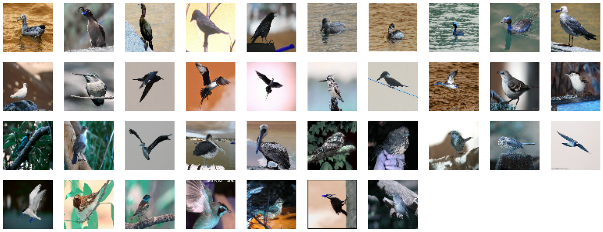

# Applying Deep learning models to image classification (Caltech-UCSD Birds-200-2011)
## Description:
- This project used the Caltech-UCSD Birds-200-2011  dataset that contains 200 classes of images birds as shown in the followed figure that cantains some sample (5 classes).

- This project used Perceptron on the Caltech-UCSD Birds-200-2011 dataset. When using the sequential model API on this data, there was overfit. To address this issue, EarlyStopping was added to the loss valance. So the train accuracy became 7.2% of 100% and the loss test was decreased at the beginning of training, but it increased at the end of training. After applying feature extraction (hog) on this data, the sequential model improved in the train accuracy by 10%, but the loss test became poor by 5.5113 out of 5.0713. As a result, hog is not appropriate in this situation. It is suggested that data augmatation be applied to the train data to improve these results.
- This project used Pretrain model that is called ResNet-101. When using the sequential model API on this data, there was overfit. To address this issue, EarlyStopping was added to the loss valance. So the train accuracy became 7.2% of 100% and the loss test was decreased at the beginning of training, but it increased at the end of training. After applying feature extraction (hog) on this data, the sequential model improved in the train accuracy by 10%, but the loss test became poor by 5.5113 out of 5.0713. As a result, hog is not appropriate in this situation. It is suggested that data augmatation be applied to the train data to improve these results.

- This project visualized the filters learned by your ResNet-101 network and used t-SNE to observe clusters that were learned by these models as shown in the following figure.

So we can cluster these images as shown in 
the following figure: 
### Cluster 0

### Cluster 1

### Cluster 2

### Cluster 3

### Cluster 4

### Cluster 5

### Cluster 6

### Cluster 7

### Cluster 8

### Cluster 9

### Cluster 10

. . . . . . .
### Cluster 199

- The function "get_weights()" was applied to get filters from all convolutional layers in these pretrained models. So, the first layer has 64 filters to know the features of each image. For plotting Tsne, the model "Model_getFliters" was created without a classifier from these pretrained models to get features for each image that were plotted in different positions.
## References
1- https://machinelearningmastery.com/how-to-visualize-filters-and-feature-maps-in-convolutional-neural-networks/

2- https://towardsdatascience.com/how-to-cluster-images-based-on-visual-similarity-cd6e7209fe34

